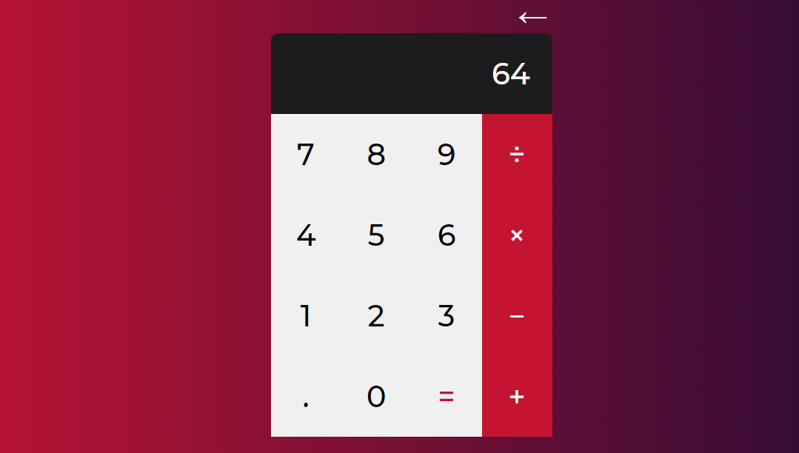

# Calculator with pure HTML/CSS/JS
<p align="center">

</p>

## Why
To summarize the basic web study, I decided to create this project to file it for someone who wants to study for it.

## Instalation

To use it,choose a folder where it will be cloned or repository, open the / cmd terminal and use the * git * command below:
```
git clone https://github.com/projetoestoque/projetoestoquelaravel.git
```
After that,open the index.html with the browser of your choice.
